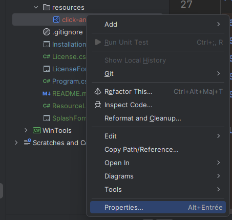
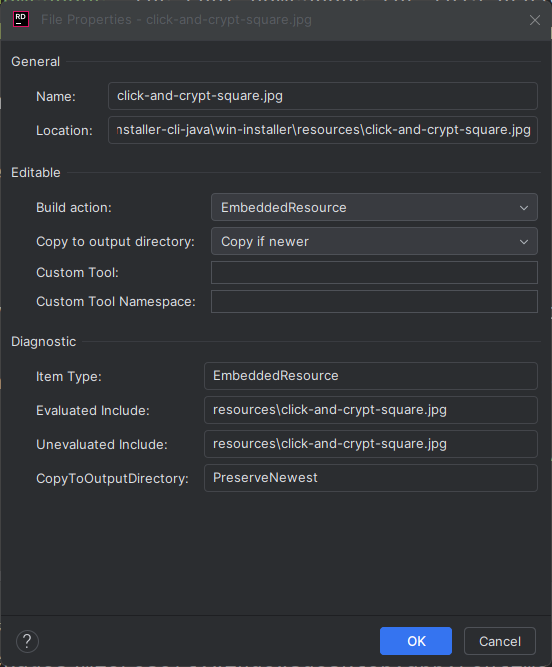

# Embed an Image as a Resource in Your Application

To embed an image into your application, follow the steps below. Let's assume:

- `${ROOT}` represents the root directory of your project.
- `project_namespace` is the root namespace for your project.
- The image to be embedded is named `click-and-crypt-square.jpg`.

### Steps:

1. **Create a Directory for Resources**  
   At the root of your project, create a dedicated subdirectory to store image resources.  
   For example, create the directory `${ROOT}/resources`.

2. **Add Your Image to the Directory**  
   Move the image you wish to embed into the directory you just created.  
   As a result, you should have the file located as `${ROOT}/resources/click-and-crypt-square.jpg` within your project.

3. **Add the File to Your Project**  
   In the **Solution Explorer**, right-click on `${ROOT}/resources/click-and-crypt-square.jpg`.

4. **Access File Properties**  
   From the context menu, select **Properties**.  
   

5. **Set File Properties**  
   In the **Properties** window:
   - Set the `Build Action` to **EmbeddedResource**.
   - Assign a name for the resource, such as `click-and-crypt-square.jpg`.  
     

6. **Add a Resource Helper Class**  
   Add the following class to your project to access the embedded image programmatically:
   
   ```csharp
   namespace project_namespace;
   using System;
   using System.Drawing;
   using System.IO;
   using System.Reflection;
   
   public class ResourceLoader
   {
       public static Image LoadEmbeddedImage(string resourceName)
       {
           Assembly assembly = Assembly.GetExecutingAssembly();
           using (Stream stream = assembly.GetManifestResourceStream(resourceName))
           {
               if (stream == null) throw new Exception($"Resource not found: {resourceName}");
               return Image.FromStream(stream);
           }
       }
   }
   ```

7. To access the embedded resource from the code:
   
   ```csharp
   // <project root namespace>.<directory name>.<resource name>
   ResourceLoader.LoadEmbeddedImage("project_namespace.resources.click-and-crypt-square.jpg")
   ```
# Links

https://www.iconfinder.com/search?q=OK